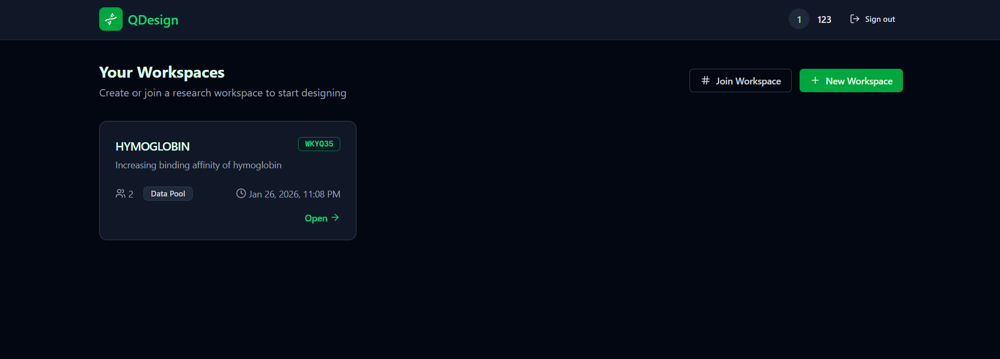
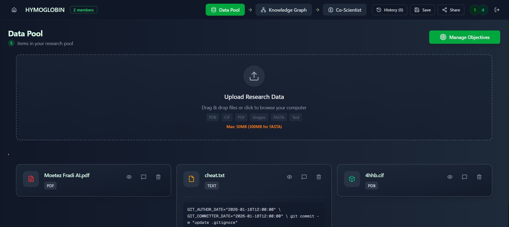
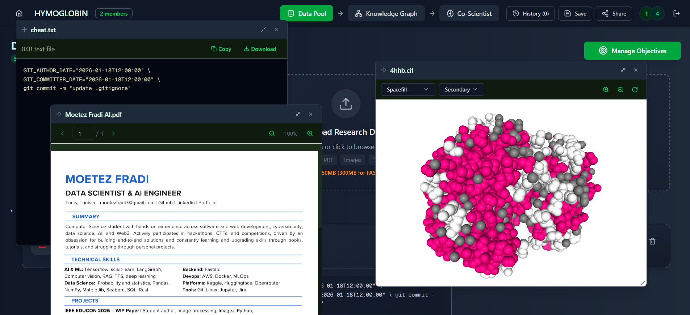

# PROJECT SPECIFICATION: QDESIGN
**Platform:** QDesign, a Collaborative AI-Driven Biological Design Workbench
**Hackathon Submission:** Use Case 4 (Multimodal Biological Design & Discovery)

## The solution in short:

Qdesign is a workspace for scientist where they can **create** "projects" (like rooms), specify the project's objectives, constraints and notes and **upload** their own files (pdfs, cif, safta, images and text), annotate and comment them and visualize them before **creating a tailored knowledge graph** for their project. Then they can expand the knowledge graph from the search engine, comment data points and mark them as high trust or not.. and finally run a coscientist that takes all the data of the workspace and tries to reach the objective without violating constraints. the response of the scientist is in chunks, and each chunk is commentable (explain this further, don't use this paper...) so the co scientist can built up a new response based on that. we also feature git like history for each secondary objective of the project and cover exporting research into pdf format in the template of IEEE research papers.

## Live URL (no LLM and retrieval endpoints included because of free tier limitations):

https://qdesign.moetezfradi.me 

credentials: 123@gmail.com password: 123456
---
## Team Members

### Development Team
- Ghassen Naouar
- Moetez Fradi
- Ahmed Saad
- Ghassen Naouar

**Screenshots of our implementation:**

#### Dashboard Interface

*Main dashboard showing the QDesign workbench interface*

*Visualization of the protein data collection and management system*

#### Data Visualization Components

*Interactive data visualization tools for exploring biological structures and relationships*
2.  **Vector-Native:** Biological similarity (shape, function, sequence) is the core logic driver.
3.  **Explainable:** Every suggestion provides an evidence trail (papers, similar experiments).

**Full demo video link:**

## System Architecture (High-Level)

**XQdrant** is our own modified version of qdrant that allows us to interpret biological similarities (more on that in the docs below) and is the brain of the whole project, it contains 4 collections : structures and sequences embedded using ESM2, pdfs using all-MiniLM-L6-v2 and images using CLIP for text + image based similarity search.

**MongoDB** is where we store the actual files, users and proejcts data.

**Core** is the main server that the ui communicates with, it is the only component communicating with the mongodb database and calls other micro services.

we have 2 main **Services** one for the knowledge graph generation / expansion and one for the co scientist.

The **UI** updates in real-time to ensure easy collaboratoin between users.

---

### Inputs (Multimodal)
The system must accept the following inputs from the user:
1.  **Text and pdf**
2.  **Structural Files:** 3D protein files (PDB/CIF format).
3.  **Sequences:** Amino acid strings (FASTA format).
4.  **Images :** Chemical structure drawings or microscopy data.

---

## Documentation

For detailed information about each component, refer to the following README files in the [docs](docs/) folder:

- [Interpretability](docs/interpretability_README.md)
- [Data](docs/data_README.md)
- [Backend Core](docs/backend_core_README.md)
- [Backend Services - Retrieval Service](docs/backend_services_retrieval_service_README.md)
- [Backend Services - Coscientist Server](docs/backend_services_coscientist_server_README.md)
- [UI](docs/ui_README.md)
- [XQdrant](docs/XQdrant_README.md)